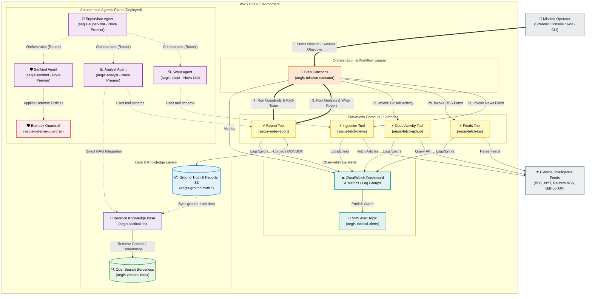
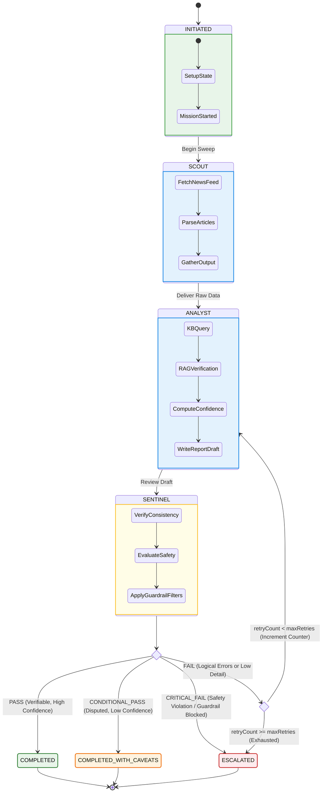
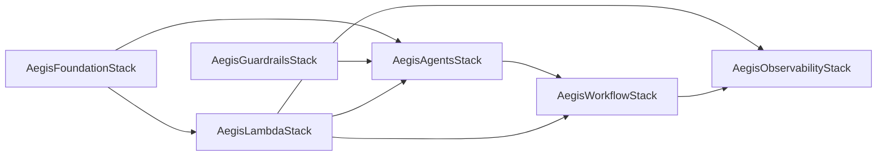

# 🛡️ Project Aegis Tactical

Production-grade, AWS-native autonomous intelligence platform that gathers live external signals, validates findings against a verified ground-truth knowledge base, produces audit-ready briefs, and exposes mission outcomes through a non-technical Streamlit Mission Console.

---

## ⚡ Tech Stack & Ecosystem


---

## 📋 Table of Contents

1. [System Capabilities](#what-this-system-does)
2. [Operator Value Proposition](#how-this-helps-operators)
3. [AWS-Native Integration Table](#aws-native-stack)
4. [End-to-End System Architecture](#end-to-end-architecture)
5. [Mission Execution Flow State Machine](#mission-execution-workflow)
6. [AWS CDK Stack-by-Stack Breakdown](#stack-by-stack-breakdown)
7. [API Data Contracts & Ingestion Schemas](#data-contracts-and-mission-outputs)
8. [System Configuration & Variables](#configuration)
9. [Development Prerequisites](#prerequisites)
10. [Repository Directory Blueprint](#repository-layout)
11. [Quick Start Installation](#quick-start)
12. [CDK Command Cheat-Sheet](#deploy-and-update-commands)
13. [Executing Missions](#run-missions)
14. [Observability & Dashboard telemetry](#observability-and-alerts)
15. [Safety, Guardrails & Policy Redaction](#security-and-guardrails)
16. [Production Readiness Checklist](#production-readiness-checklist)
17. [Financial & Cost Analysis](#cost-notes)
18. [Local Validation & Testing](#testing)
19. [Common Troubleshooting Scenarios](#troubleshooting)
20. [Resource Cleanup Guide](#cleanup)

---

## What This System Does

Aegis Tactical executes automated research missions based on user objectives:

1. **Accept Objective**: Reads mission parameters from the Streamlit UI or AWS CLI.
2. **Collect Signals (Scout)**: Dynamically sweeps external feeds (RSS news feeds, GitHub repository activity, APIs).
3. **Verify Claims (Analyst)**: Cross-references raw, unstructured intelligence against structured, verified ground-truth documents in a RAG vector database.
4. **Red-Team & Safeguard (Sentinel)**: Evaluates reports for hallucinations, checks confidence ratings, and applies Bedrock Guardrails to sanitize output.
5. **Publish Artifacts**: Writes final Markdown briefs and JSON outputs to Amazon S3.
6. **Alert Operators**: Sends notifications on failures, and feeds real-time metrics to CloudWatch dashboards.

---

## How This Helps Operators

* **Saves Hours of Research**: Automates data ingestion and filtering across multiple channels.
* **Evidence-Backed Insights**: Outputs clear confidence scores, citations, and evidence lists.
* **Traceable Decisions**: Creates an immutable execution and report history in S3.
* **Strict Guardrails**: Prevents leakage of PII, internal codes, or execution of destructive operations.
* **Simplified Console**: Streamlit dashboard makes it easy for non-technical users to trigger and monitor runs.

---

## AWS-Native Stack

| AWS Service | Icon | Core Responsibility in Aegis | Setup Details |
| :--- | :---: | :--- | :--- |
| **Amazon Bedrock Agents** |  | Multi-Agent Collaboration Plane | Supervisor agent routes inquiries to Scout, Analyst, or Sentinel collaborators. |
| **Bedrock Knowledge Base** |  | RAG Vector Retrieval | Uses Titan Embeddings V2 (1024-dim), linked to OpenSearch Serverless. |
| **Bedrock Guardrails** |  | System Safety & Privacy | Content filtering, denylist rules, and PII anonymization. |
| **AWS Step Functions** |  | Orchestrated Execution Pipeline | Orchestrates the tool Lambdas, retries, and conditional verdict routing. |
| **AWS Lambda** |  | Serverless Execution Tools | Specialized tools for RSS reading, GitHub API pulling, and S3 report writing (Python 3.12). |
| **Amazon S3** |  | Corpus & Brief Storage | Holds Ground Truth document corpus and generated Markdown reports. |
| **OpenSearch Serverless** |  | Vector Database | Serverless collection using HNSW indexing (FAISS engine) for fast semantic search. |
| **Amazon CloudWatch** |  | Observability Suite | Operates Dashboards, Logs retention (2 weeks to 1 month), and error alarms. |
| **Amazon SNS** |  | Alert Notification Hub | Distributes systems alarms to operator endpoints. |

---

## End-to-End Architecture

The following diagram illustrates how the system's operational layers interact, highlighting the separation between the automated orchestration pipeline (Step Functions invoking Lambda tools) and the deployed Bedrock Agent plane.



> [!NOTE]
> **Runtime Strategy**: The active Step Functions workflow invokes the Python Lambda tools directly to process news and generate report artifacts. The Bedrock Agent plane is fully deployed in AWS, ready for agent-native routing, testing, and supervisor collaboration logic.

---

## Mission Execution Workflow

The State Machine guides each execution through defined stages. A report must satisfy safety and confidence thresholds before it is approved.



---

## Stack-by-Stack Breakdown

Aegis is divided into 6 layered CDK Stacks. Stacks must be deployed in the logical order of their dependency graph.



### 1. AegisFoundationStack
Configures primary data channels:
* **S3 Ground Truth Bucket**: Stores operational documents and reports. Features managed encryption, public access blocking, and auto-delete hooks for development ease.
* **Amazon OpenSearch Serverless**: Sets up collections, encryption policies, and network rules. Builds the vector index using the FAISS engine (L2 distance, 1024 dimensions).
* **Bedrock Knowledge Base**: Binds S3 files and the vector index using Titan Embeddings V2. Sets up automatic document chunking and ingestion mapping.

### 2. AegisLambdaStack
Provisions serverless Python runtime environments for tools:
* **`aegis-fetch-news`**: Searches RSS streams.
* **`aegis-fetch-rss`**: Direct parser for standard web feeds.
* **`aegis-fetch-github`**: Collects repo activity logs.
* **`aegis-write-report`**: Writes Markdown and JSON reports directly to the Ground Truth S3 bucket.
* *Configuration details*: Python 3.12, 30-second execution limit, 256MB memory allocations, least-privilege IAM profiles, and automatic CloudWatch Log Group bindings.

### 3. AegisGuardrailsStack
Establishes system policies via Amazon Bedrock Guardrails:
* **Content Filtering**: Active filters block hate, insults, sexual content, and violence.
* **Prompt Injection Control**: Stops attempts to bypass model instructions.
* **Topic Deny Lists**: Prevents unauthorized modifications (e.g. `DROP TABLE`, destructive API calls) and blocked information lookup.
* **PII Governance**: Anonymizes emails, phones, names, and IP addresses. Blocks SSNs and access keys.

### 4. AegisAgentsStack
Instantiates the specialized Bedrock Agents:
* **Scout Agent** (Nova Lite): Fetches news and GitHub details.
* **Analyst Agent** (Nova Premier): Validates data against the Knowledge Base and outputs S3 reports.
* **Sentinel Agent** (Nova Premier): Conducts red-teaming checks and runs guardrail scanning.
* **Supervisor Agent** (Nova Premier): Directs collaborator sub-agents using a `SUPERVISOR_ROUTER` pattern.

### 5. AegisWorkflowStack
Deploys the Step Functions workflow (`aegis-mission-executor`):
* Handles state transitions: Scout $\rightarrow$ Analyst $\rightarrow$ Sentinel.
* Executes loop evaluations, increments retry metrics, and routes execution results.
* Provisions EventBridge scheduling options for daily sweep missions.

### 6. AegisObservabilityStack
Establishes active systems telemetry:
* **CloudWatch Dashboard**: `AegisTactical-Operations` provides live panels showing mission counts, runtimes, and Lambda latencies.
* **Alarms**: Triggers on mission failure thresholds, Lambda exceptions, or pipeline timeout limits.
* **Alerting Topic**: An SNS topic (`aegis-tactical-alerts`) sends notifications to operator endpoints.

---

## Data Contracts and Mission Outputs

### Mission Input Contract
Submit executions using the following JSON schema:
```json
{
  "objective": "Verify the stability of shipping lanes through the Red Sea and Gulf of Aden."
}
```

### Mission Output Payload
Upon completion, the state machine returns a structured report object:
```json
{
  "status": "COMPLETED_WITH_CAVEATS",
  "verdict": "CONDITIONAL_PASS",
  "confidenceScore": 0.72,
  "missionId": "mission-console-20260522-113000",
  "analystVerdict": "DISPUTED",
  "directAnswer": "Disputed: Regional reports indicate isolated incidents, though convoy activity remains active.",
  "reportLocation": "s3://aegis-ground-truth-account-region/reports/2026/05/22/mission-console-20260522-113000.md",
  "objective": "Verify the stability of shipping lanes through the Red Sea and Gulf of Aden."
}
```

### Analyst Evaluation Framework
The report engine evaluates sources using the following criteria:
* **Confidence Metric**: Calculates trust scores, source diversity factors, volume of data, and deducts points for conflicts.
* **Evidence Classification**: Flags details as `HIGH`, `MEDIUM`, or `LOW` quality.
* **Synthesis Verdict**: Assigns classifications such as `SUPPORTED`, `PARTIALLY_SUPPORTED`, `DISPUTED`, or `INSUFFICIENT_EVIDENCE`.

---

## Configuration

Context definitions are defined in [cdk.json](file:///d:/Projects/Bajra/cdk.json). Update context settings during deployment:
```bash
npx cdk deploy --all --require-approval never -c aegis:region=us-west-2 -c aegis:environment=prod
```

### Lambda Environment Context
System limits are defined inside [lib/lambda-stack.ts](file:///d:/Projects/Bajra/lib/lambda-stack.ts):
* `MAX_ARTICLES` / `MAX_ENTRIES` / `MAX_RESULTS`: Controls chunk sizes and RSS retrieval bounds.
* `REPORT_PREFIX`: Key namespace where generated files are placed in S3.

---

## Prerequisites

Ensure your development environment meets the following requirements:
* **AWS CLI**: Installed and configured with permissions for Amazon Bedrock, OpenSearch Serverless, Lambda, and Step Functions.
* **Node.js**: Version 18.0 or newer.
* **Python**: Version 3.10 or newer (for console execution).
* **AWS CDK CLI**: Version 2.x installed globally:
  ```bash
  npm install -g aws-cdk
  ```
* **Model Access**: Ensure the following models are enabled in your active region (e.g., `us-east-1`):
  * `us.amazon.nova-premier-v1:0` (Premier Reasoning)
  * `us.amazon.nova-lite-v1:0` (Lite Speed)
  * `amazon.titan-embed-text-v2:0` (Vector Embeddings)

---

## Repository Layout

```text
aegis-tactical/
├── bin/
│   └── aegis-tactical.ts         # CDK App entry point - maps & instantiates all stacks
├── lib/
│   ├── foundation-stack.ts       # Provisions S3 Bucket, OpenSearch Serverless, & Bedrock KB
│   ├── lambda-stack.ts           # Deploys Python helper functions (tools)
│   ├── guardrails-stack.ts       # Sets up PII, Content, and Topic Bedrock Guardrails
│   ├── agents-stack.ts           # Sets up Scout, Analyst, Sentinel, and Supervisor Bedrock Agents
│   ├── workflow-stack.ts         # Orchestrates the Step Functions execution workflow
│   └── observability-stack.ts    # Configures CloudWatch Dashboards, Log Groups, Alarms, and SNS
├── lambda/                       # Lambda Function Codebases
│   ├── fetch_news/               # Keyword-based RSS news headlines aggregator
│   ├── fetch_rss/                # Generic URL feed parser
│   ├── fetch_github/             # GitHub commit and issue scraper
│   └── write_report/             # Writes Markdown and JSON reports to S3
├── agents/                       # Local Python agent validation harness
│   ├── supervisor/               # Supervisor agent routing script
│   ├── scout/                    # Scout gatherer script
│   ├── analyst/                  # Analyst verification script
│   ├── sentinel/                 # Sentinel red-team evaluation script
│   └── config.py                 # Centralized configuration class loader
├── frontend/                     # Operations Mission Console UI
│   ├── app.py                    # Streamlit Console application logic
│   └── requirements.txt          # Python frontend requirements list
├── data/
│   └── ground-truth/             # Raw PDFs/TXT files copied to S3 during deployment
└── test/
    └── aegis-tactical.test.ts    # Integration and deployment tests
```

---

## Quick Start

### 1. Install Dependencies
```bash
npm install
```

### 2. Configure Local Virtual Environments (Optional)
Setup local runners for testing the agent definitions and launching the console:

**For the Agents harness:**
```bash
cd agents
python -m venv .venv
source .venv/bin/activate      # On Windows: .venv\Scripts\activate
pip install -r requirements.txt
cd ..
```

**For the Mission Console:**
```bash
cd frontend
python -m venv .venv
source .venv/bin/activate      # On Windows: .venv\Scripts\activate
pip install -r requirements.txt
cd ..
```

### 3. Bootstrap your AWS Account
```bash
npx cdk bootstrap
```

### 4. Synthesize CloudFormation Templates
```bash
npx cdk synth
```

### 5. Deploy all Stacks
```bash
npx cdk deploy --all --require-approval never
```

---

## Deploy and Update Commands

Deploying everything at once:
```bash
npx cdk deploy --all --require-approval never
```

### Deploying Specific Layers
Make modifications and deploy individual components:
```bash
# Update Lambda logic only
npx cdk deploy AegisLambdaStack --require-approval never

# Update State Machine configurations
npx cdk deploy AegisWorkflowStack --require-approval never

# Update Telemetry dashboards
npx cdk deploy AegisObservabilityStack --require-approval never
```

### Compare Local Changes against AWS Live Stacks
```bash
npx cdk diff AegisWorkflowStack
```

---

## Run Missions

### Option A: Streamlit Mission Console
1. Activate your virtual environment and start the app:
   ```bash
   cd frontend
   source .venv/bin/activate    # On Windows: .venv\Scripts\activate
   streamlit run app.py
   ```
2. Submit your objective (e.g. "Assess container traffic delays in the Suez Canal").
3. Monitor execution states, download generated reports, and view CloudWatch dashboard metrics in real time.

### Option B: AWS Command Line Interface
Trigger an execution directly through AWS Step Functions:
```bash
aws stepfunctions start-execution \
  --state-machine-arn "arn:aws:states:us-east-1:ACCOUNT_ID:stateMachine:aegis-mission-executor" \
  --name "cli-mission-$(date +%s)" \
  --input '{"objective":"Assess container traffic delays in the Suez Canal"}'
```

Monitor execution status:
```bash
aws stepfunctions describe-execution --execution-arn "YOUR_EXECUTION_ARN"
```

---

## Observability and Alerts

### Operational Panels
Open the CloudWatch console and view the `AegisTactical-Operations` Dashboard. Metrics update in 5-minute intervals:
* **Active Execution Counts**: Tracks runs that are initiated, completed, or failed.
* **Pipeline Run Latencies**: Displays durations of successful runs.
* **Component Performance**: Graphs execution counts, error counts, and processing times for the Lambda tools.

### Configured System Alarms
* `aegis-mission-failure`: Activates if 3 or more runs fail within 15 minutes.
* `aegis-mission-timeout`: Alerts if a mission exceeds 30 minutes.
* `aegis-[tool]-errors`: Alarms if Lambda error counts exceed 5 errors in a 5-minute evaluation period.
* *Alarms automatically publish alert notifications to the `aegis-tactical-alerts` SNS Topic.*

---

## Security and Guardrails

### Active Policies
Aegis applies Bedrock Guardrails to sanitize output:
* **Content Moderation**: Denies offensive, hate, or violent inputs and outputs.
* **Access Safeguards**: Topic blocking prevents attempts to run destructive CLI commands or security exploits.
* **Data Anonymization**: Scans outputs for PII (names, phone numbers, emails, IP addresses) and anonymizes them. Blocks SSNs, passwords, and AWS credentials.
* **Project Redaction**: Detects internal project code formats (such. as `AEGIS-[A-Z0-9]`) and redacts them.

---

## Production Readiness Checklist

Before moving to production, complete the following configuration steps:

- [ ] **Account Isolation**: Deploy Aegis in a dedicated, isolated AWS account.
- [ ] **Data Retention**: Change deletion policies (`RemovalPolicy.DESTROY` and `autoDeleteObjects`) to `RETAIN` on S3 buckets and OpenSearch logs.
- [ ] **Network Lockdown**: Restrict OpenSearch network policies to specific VPC interfaces instead of public access.
- [ ] **Secret Injection**: Replace hardcoded tokens with AWS Secrets Manager or Parameter Store references.
- [ ] **Notification Handlers**: Subscribe production paging systems or webhooks to the `aegis-tactical-alerts` SNS Topic.
- [ ] **Log Optimization**: Adjust CloudWatch logs retention policies to align with enterprise audit rules.
- [ ] **Continuous Sweeps**: Enable the daily EventBridge schedule to run recurring sweeps.

---

## Cost Notes

Baseline operations incur charges for running infrastructure:
* **OpenSearch Serverless**: Charges for index capacity units (OCUs).
* **Bedrock Tokens**: Costs scale based on input/output tokens processed during agent routing.
* **Telemetry**: standard CloudWatch ingestion and storage charges.

---

## Testing

Verify the local project compiles and stack definitions match schema rules:
```bash
# Run unit and integration tests
npm test

# Verify CDK definitions synthesize correctly
npx cdk synth
```

---

## Troubleshooting

### 1. Streamlit exits with Code 1 on Startup
* **Cause**: Missing python dependencies or virtual environment is inactive.
* **Resolution**: Run `pip install -r requirements.txt` inside your active virtual environment.

### 2. Runs Return Zero Results
* **Cause**: Ingestion keyword search matches no articles, or feeds are inaccessible.
* **Resolution**: Ensure the objective includes specific keywords. Test internet connectivity inside the lambda execution VPC context.

### 3. Conflicting and Contradictory Outputs
* **Cause**: External data feeds contain conflicting information.
* **Resolution**: This is expected behavior. The Analyst agent flags findings as `DISPUTED` and lowers the overall confidence score.

### 4. OpenSearch Collection Fails to Deploy
* **Cause**: IAM deployment role lacks permissions, or active region lacks support for OpenSearch Serverless collections.
* **Resolution**: Verify that the execution role contains standard administrator policies and OpenSearch Serverless is available in your region.

---

## Cleanup

Destroy all deployed infrastructure to avoid ongoing charges:
```bash
npx cdk destroy --all
```

Check the AWS Management Console to confirm that OpenSearch collections and S3 buckets were successfully removed.
