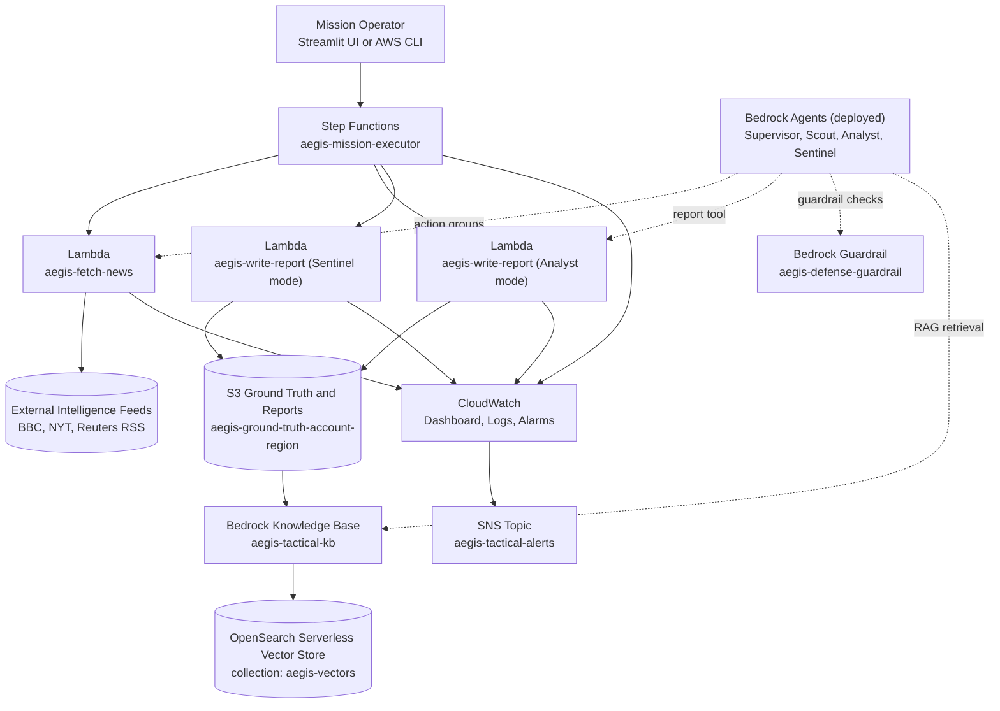
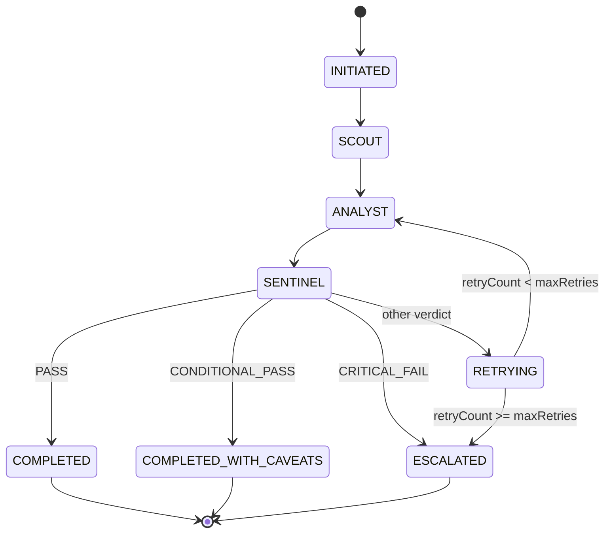
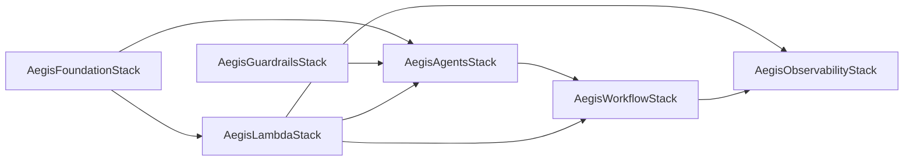

# Project Aegis Tactical

Production-grade, AWS-native intelligence platform that gathers live external signals, produces evidence-backed reports, and exposes mission outcomes through a non-technical Mission Console.

The system combines:

- AWS CDK infrastructure as code
- Amazon Bedrock Agents (Supervisor, Scout, Analyst, Sentinel) with collaborator strands
- Bedrock Knowledge Base + OpenSearch Serverless for RAG
- Bedrock Guardrails for safety and PII controls
- Lambda toolchain for ingestion and reporting
- Step Functions mission orchestration
- CloudWatch observability and alerting
- Streamlit Mission Console for operators

---

## Table of Contents

1. What This System Does
2. How This Helps Operators
3. AWS-Native Stack
4. End-to-End Architecture
5. Mission Execution Workflow
6. Stack-by-Stack Breakdown
7. Data Contracts and Mission Outputs
8. Configuration
9. Prerequisites
10. How to Use This Repo
11. Quick Start
12. Deploy and Update Commands
13. Run Missions
14. Observability and Alerts
15. Security and Guardrails
16. Production Readiness Checklist
17. Cost Notes
18. Testing
19. Troubleshooting
20. Repository Layout
21. Cleanup

---

## What This System Does

Aegis Tactical executes missions with this operational flow:

1. Accept an objective from Streamlit UI or AWS CLI.
2. Gather intelligence from external feeds.
3. Analyze evidence and compute dynamic verdicts and confidence.
4. Red-team the analysis outcome and route final mission status.
5. Write Markdown and JSON reports to S3.
6. Expose mission state, output, and health telemetry in CloudWatch and the UI.

The system is designed to answer questions with explicit caveats, confidence, and evidence context.

---

## How This Helps Operators

- Turns open-ended objectives into evidence-backed briefs with explicit confidence scores.
- Reduces analyst time by automating collection, verification, and report generation.
- Creates an auditable trail with S3 report artifacts and CloudWatch execution history.
- Enforces safety and escalation paths before reports are released.
- Gives non-technical users a Mission Console for running and reviewing missions.

---

## AWS-Native Stack

Aegis is built as an AWS-native multi-agent "strands" pattern: a Supervisor agent orchestrates Scout,
Analyst, and Sentinel collaborators using Bedrock runtime aliases. The current Step Functions workflow
invokes Lambda tools directly, while the Bedrock agent plane is deployed and ready for agent-native execution.

| AWS service | Purpose in Aegis |
| --- | --- |
| AWS CDK | Infrastructure as code for all stacks |
| Amazon Bedrock Agents | Supervisor and collaborator agents with tool access |
| Amazon Bedrock Knowledge Base | RAG over ground-truth documents |
| Amazon Bedrock Guardrails | Safety, PII, and policy enforcement (agent plane) |
| AWS Lambda | Intelligence ingestion and report writing tools |
| AWS Step Functions | Mission orchestration, retries, and routing |
| Amazon S3 | Ground-truth storage and report artifacts |
| Amazon OpenSearch Serverless | Vector store for Knowledge Base embeddings |
| Amazon CloudWatch | Logs, metrics, dashboards, alarms |
| Amazon SNS | Alert fan-out |
| Amazon EventBridge | Optional scheduled missions |
| AWS IAM | Least-privilege roles and permissions |

---

## End-to-End Architecture



### Important Runtime Note

The Step Functions mission path currently invokes Lambda tools directly for Scout, Analyst, and Sentinel stages.

Bedrock Agents are fully deployed and wired with collaborators/action groups, but they are currently used as a deployed agent plane rather than the active Step Functions execution path.

---

## Mission Execution Workflow



Mission retries are bounded with maxRetries = 2.

---

## Stack-by-Stack Breakdown

### Deployment Dependency Graph



### 1) AegisFoundationStack

Core data foundation:

- S3 bucket for documents and reports
- OpenSearch Serverless vector collection and index
- Bedrock Knowledge Base using Titan Embeddings V2
- Initial ground-truth data deployment from data/ground-truth

Key details:

- Bucket: S3-managed encryption, versioning enabled, auto-delete for cleanup
- OpenSearch index: faiss + hnsw, 1024-dim vectors
- Knowledge Base field mapping: embedding/text/metadata

### 2) AegisLambdaStack

Tool Lambdas:

- aegis-fetch-news
- aegis-fetch-rss
- aegis-fetch-github
- aegis-write-report

Key details:

- Runtime: Python 3.12
- Timeout: 30s
- Memory: 256 MB
- Dedicated CloudWatch log groups

### 3) AegisGuardrailsStack

Bedrock guardrail with:

- Content filters (hate, insults, sexual, violence, misconduct, prompt attack)
- Denied topics for destructive operations and exploit requests
- PII detection/anonymization/blocking
- Managed profanity list and custom word blocklist

### 4) AegisAgentsStack

Deployed Bedrock agents:

- aegis-supervisor
- aegis-scout
- aegis-analyst
- aegis-sentinel

Key details:

- Model families: Nova Premier and Nova Lite
- Runtime aliases created for collaborator wiring
- Supervisor collaborator graph configured with Scout, Analyst, Sentinel
- Analyst has Knowledge Base access
- Sentinel has guardrail integration

### 5) AegisWorkflowStack

State machine:

- Name: aegis-mission-executor
- Steps: Initialize -> Scout -> Analyst -> Sentinel -> Verdict Routing
- Verdict outputs: PASS, CONDITIONAL_PASS, CRITICAL_FAIL, escalation paths
- Daily EventBridge schedule exists but is disabled by default

### 6) AegisObservabilityStack

Operational monitoring:

- CloudWatch dashboard: AegisTactical-Operations
- Alarms for mission failures, Lambda errors, mission duration
- SNS alert topic: aegis-tactical-alerts
- Structured log groups for agent namespaces

---

## Data Contracts and Mission Outputs

### Mission Input

Step Functions execution expects:

```json
{
  "objective": "Investigate whether commercial shipping through the Strait of Hormuz is currently stable"
}
```

### Mission Output

Typical successful output from state machine:

```json
{
  "status": "COMPLETED_WITH_CAVEATS",
  "verdict": "CONDITIONAL_PASS",
  "confidenceScore": 0.72,
  "missionId": "mission-ui-verify-20260419-000733",
  "analystVerdict": "DISPUTED",
  "directAnswer": "Disputed: sources conflict, so the answer is not stable yet.",
  "reportLocation": "s3://.../reports/yyyy/mm/dd/mission-id.md",
  "objective": "..."
}
```

### Analyst Logic (current behavior)

The analyst report pipeline computes:

- confidence score from source trust, source diversity, evidence volume, contradiction penalty
- evidence quality labels (HIGH, MEDIUM, LOW)
- analyst verdict (SUPPORTED, PARTIALLY_SUPPORTED, DISPUTED, INSUFFICIENT_EVIDENCE, LOW_CONFIDENCE)
- direct answer summary
- suggested sentinel route (PASS, CONDITIONAL_PASS, CRITICAL_FAIL)

### Report Artifacts

Each mission writes:

- Markdown report: reports/yyyy/mm/dd/mission-id.md
- JSON report payload: reports/yyyy/mm/dd/mission-id.json

---

## Configuration

### CDK context

Defaults are defined in cdk.json:

- aegis:region (default us-east-1)
- aegis:environment (default dev)

Override per deployment:

```bash
npx cdk deploy --all --require-approval never -c aegis:region=us-west-2 -c aegis:environment=prod
```

### Lambda runtime tuning

Defaults are set in lib/lambda-stack.ts:

- MAX_ARTICLES, MAX_ENTRIES, MAX_RESULTS
- LOG_LEVEL
- REPORT_BUCKET, REPORT_PREFIX

Update these values in the stack before deployment if your workload needs different limits.

### Secrets and tokens

GITHUB_TOKEN is intentionally empty by default. For production, store the token in AWS Secrets Manager or
SSM Parameter Store and inject it into the Lambda environment during deployment.

---

## Prerequisites

- AWS account with permissions for CDK, Lambda, Step Functions, Bedrock, OpenSearch Serverless, CloudWatch, SNS, S3.
- AWS CLI configured:

```bash
aws configure
```

- Node.js 18+ and npm 9+
- Python 3.10+
- AWS CDK CLI:

```bash
npm install -g aws-cdk
```

- Bedrock model access in deployment region (default us-east-1):

  - us.amazon.nova-premier-v1:0
  - us.amazon.nova-lite-v1:0
  - amazon.titan-embed-text-v2:0

---

## How to Use This Repo

Typical flow:

1. Install prerequisites.
2. Deploy the CDK stacks.
3. Run missions via the Mission Console or Step Functions CLI.
4. Review reports in S3 and monitor CloudWatch for health and alerts.

For details, follow the Quick Start, Run Missions, and Observability sections below.

---

## Quick Start

### Install dependencies

```bash
npm install
```

Optional local Python environment for agents and UI:

```bash
cd agents
python -m venv .venv
.venv\Scripts\activate
pip install -r requirements.txt
cd ..
```

```bash
cd frontend
python -m venv .venv
.venv\Scripts\activate
pip install -r requirements.txt
cd ..
```

### Bootstrap and synth

```bash
npx cdk bootstrap
npx cdk synth
```

### Deploy all stacks

```bash
npx cdk deploy --all --require-approval never
```

---

## Deploy and Update Commands

### Full deploy

```bash
npx cdk deploy --all --require-approval never
```

### Typical incremental deploys

```bash
npx cdk deploy AegisLambdaStack --require-approval never
npx cdk deploy AegisWorkflowStack --require-approval never
npx cdk deploy AegisObservabilityStack --require-approval never
```

### Diff before deploy

```bash
npx cdk diff AegisWorkflowStack
```

---

## Run Missions

### Option A: Mission Console (Streamlit)

```bash
cd frontend
python -m venv .venv
.venv\Scripts\activate
pip install -r requirements.txt
streamlit run app.py
```

Mission Console capabilities:

- launch missions
- inspect mission runs and outputs
- preview/download reports
- view alarm health and dashboard link

### Option B: AWS CLI

```bash
aws stepfunctions start-execution \
  --state-machine-arn "arn:aws:states:us-east-1:ACCOUNT_ID:stateMachine:aegis-mission-executor" \
  --name "manual-$(date +%s)" \
  --input '{"objective":"Investigate shipping risk through the Strait of Hormuz"}'
```

Then inspect:

```bash
aws stepfunctions describe-execution --execution-arn "EXECUTION_ARN"
```

---

## Observability and Alerts

### CloudWatch Dashboard

Dashboard output is exported by AegisObservabilityStack and shown in Mission Console.

Tracks:

- started/succeeded/failed missions
- mission duration
- Lambda invocations/errors/latency

### Alarms

Built-in alarms include:

- aegis-mission-failure
- aegis-mission-timeout
- aegis-fetch-news-errors
- aegis-fetch-rss-errors
- aegis-fetch-github-errors
- aegis-write-report-errors

### Notifications

Alarms publish to SNS topic aegis-tactical-alerts.

---

## Security and Guardrails

Guardrail coverage:

- harmful content filters
- prompt attack controls
- destructive operation topic denies
- exploit and malware topic denies
- PII and credential blocking/anonymization
- custom blocked terms

Operational safety behavior:

- low confidence or contradictory evidence routes to CONDITIONAL_PASS or CRITICAL_FAIL
- escalation path is explicit in Step Functions for retry exhaustion and critical flags

Guardrails are attached to the Bedrock Sentinel agent. The current Step Functions path uses Lambda-based
Analyst and Sentinel runs, so guardrails apply when running through the Bedrock agent plane.

---

## Production Readiness Checklist

- Set aegis:environment to prod and deploy into a dedicated AWS account and region.
- Replace RemovalPolicy.DESTROY and autoDeleteObjects with RETAIN on S3 buckets, log groups, and indices
  you must preserve.
- Restrict OpenSearch Serverless network policies if public access is not required.
- Move tokens and secrets to AWS Secrets Manager or SSM Parameter Store; avoid hard-coded values.
- Subscribe the SNS topic to your paging or chat system.
- Review CloudWatch retention periods and alarm thresholds for your SLAs.
- Enable the EventBridge schedule only after you validate guardrails and escalation rules.

---

## Cost Notes

Major cost drivers:

- OpenSearch Serverless baseline OCUs
- Bedrock inference usage
- CloudWatch logs/metrics retention

Always clean up when done:

```bash
npx cdk destroy --all
```

---

## Testing

```bash
npm test
npx cdk synth
npx cdk diff
```

---

## Troubleshooting

### 1) Streamlit exits with code 1

Usually caused by missing virtual environment packages.

Fix:

```bash
cd frontend
python -m venv .venv
.venv\Scripts\activate
pip install -r requirements.txt
streamlit run app.py
```

### 2) Mission has zero results

Use objective terms that reference concrete entities and domains. The ingestion Lambda now does keyword extraction and relevance thresholds.

### 3) Report looks contradictory

This is expected when sources conflict. The system should return DISPUTED with CONDITIONAL_PASS and lower verification confidence.

### 4) Bedrock or OpenSearch deploy issues

Verify:

- model access enabled in region
- CDK execution role has required Bedrock and AOSS permissions
- index exists before Knowledge Base binding (handled in Foundation stack)

---

## Repository Layout

```text
bin/
  aegis-tactical.ts
lib/
  foundation-stack.ts
  lambda-stack.ts
  guardrails-stack.ts
  agents-stack.ts
  workflow-stack.ts
  observability-stack.ts
lambda/
  fetch_news/
  fetch_rss/
  fetch_github/
  write_report/
agents/
  supervisor/
  scout/
  analyst/
  sentinel/
frontend/
  app.py
  requirements.txt
data/
  ground-truth/
test/
  aegis-tactical.test.ts
```

---

## Cleanup

```bash
npx cdk destroy --all
```

For active accounts, also verify OpenSearch and S3 resources are removed as expected.
